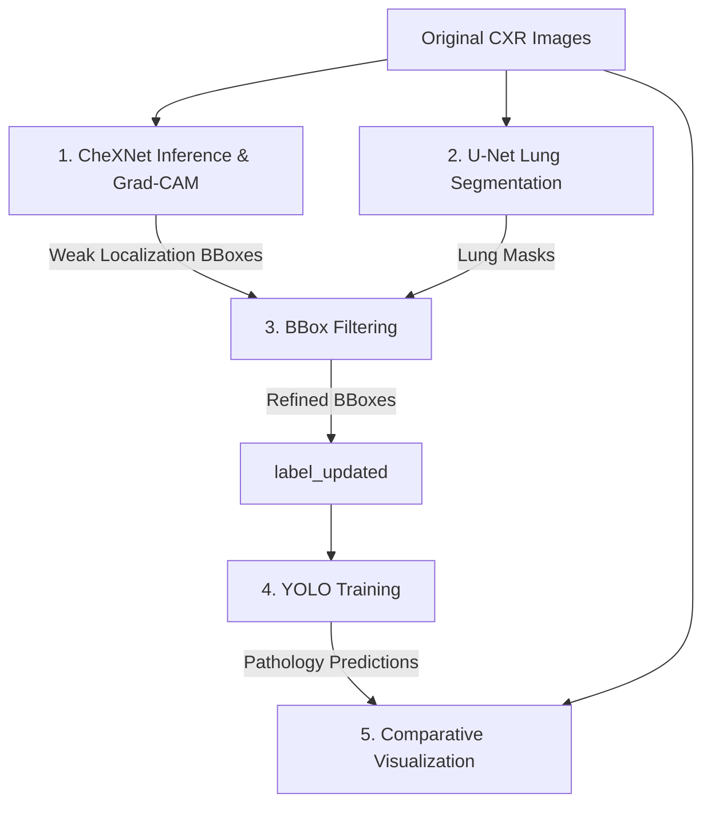

# Chest X-Ray Analysis & YOLO Training Pipeline: Project Summary

This project implements a multi-stage deep learning pipeline for chest X-ray classification, lung segmentation, bounding box filtering, and object detection.

---

## 🏗️ Pipeline Architecture Overview

The system combines three deep learning paradigms (classification/localization, segmentation, and object detection) to build a refined chest pathology detector:

---

## 📂 Key Components & Workflow

### 1. Classification & Weak Localization (CheXNet)
* **Location**: [`forked/CheXNet-Inference/inference`](file:///c:/Gojii/xray%20lung/forked/CheXNet-Inference/inference)
* **Description**: Uses a DenseNet121 model pre-trained on chest X-rays (CheXNet) to predict multi-label pathologies.
* **Grad-CAM**: Generates heatmaps from the activation maps of the final convolutional layers. These heatmaps are used to generate weak localization bounding boxes, which are saved in YOLO format.

### 2. Lung Segmentation (U-Net)
* **Location**: [`forked/CheXNet-Inference/lung segmentation`](file:///c:/Gojii/xray%20lung/forked/CheXNet-Inference/lung%20segmentation)
* **Description**: Runs a pretrained U-Net model (`unet-6v.pt`) on original chest X-rays to segment the lungs and output binary ROI masks under `output_masks/`.

### 3. Bounding Box Filtering & Label Refinement
* **Location**: [`forked/CheXNet-Inference/lung segmentation/filter_bboxes.py`](file:///c:/Gojii/xray%20lung/forked/CheXNet-Inference/lung%20segmentation/filter_bboxes.py)
* **Description**: Correlates the weak localization bounding boxes (from CheXNet) with the lung segmentation masks.
* **Filtering Logic**: If a bounding box does not intersect with the lung segmentation mask, it is considered a false positive (outside the lung region) and deleted. The remaining boxes are saved as the refined dataset in [`lung segmentation/label_updated/`](file:///c:/Gojii/xray%20lung/forked/CheXNet-Inference/lung%20segmentation/label_updated).

### 4. YOLO Object Detection Training
* **Location**: [`Lung-X-Ray-YOLO-Training`](file:///C:/Gojii/xray%20lung/Lung-X-Ray-YOLO-Training)
* **Description**: Trains multiple YOLO model configurations (Nano `n`, Small `s`, Medium `m`, Large `l`, and X-Large `x`) using the refined dataset splits.

### 5. Comparative Visualization
* **Location**: [`Lung-X-Ray-YOLO-Training/generate_inference.py`](file:///C:/Gojii/xray%20lung/Lung-X-Ray-YOLO-Training/generate_inference.py)
* **Description**: Runs inference across all trained YOLO models and outputs side-by-side comparative visualizations in the [`visualization_vs_yolo/`](file:///c:/Gojii/xray%20lung/forked/CheXNet-Inference/visualization_vs_yolo) directory.
* **Visualization Columns**:
  1. **GROUND TRUTH** (Original annotations - Green)
  2. **UPDATED GROUND TRUTH** (Refined annotations filtered by U-Net lung masks - Yellow)
  3. **YOLO MODEL PREDICTION** (Model outputs - Red)

---

## 📈 Current Project State & Accomplishments
1. **Fully Integrated Pipelines**: Classification, segmentation, filtering, training, and visualization pipelines are fully functioning.
2. **Refined Annotation Generation**: Filtered out pathological annotations outside the lung area via segmentation intersection.
3. **Multi-Model Comparisons**: Comparative visualization outputs are successfully generated for **215 images** across `train`, `valid`, and `test` splits, directly outputting inside [visualization_vs_yolo/](file:///c:/Gojii/xray%20lung/forked/CheXNet-Inference/visualization_vs_yolo).
